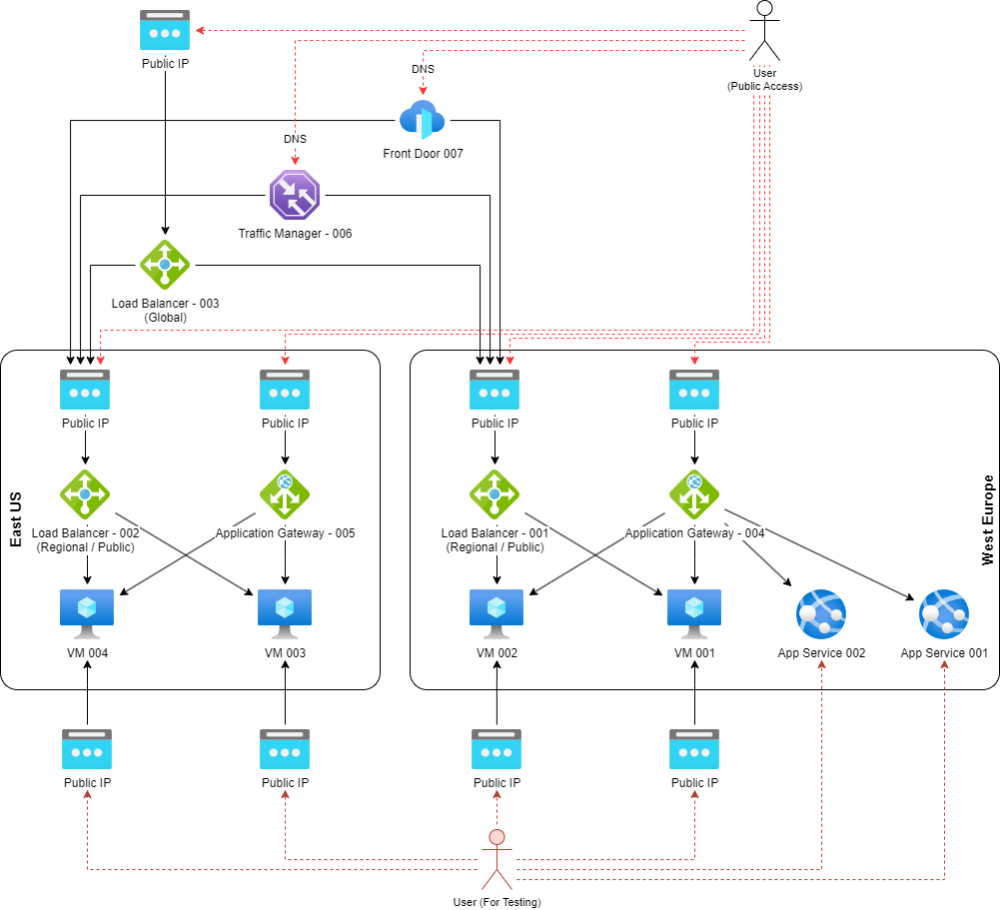
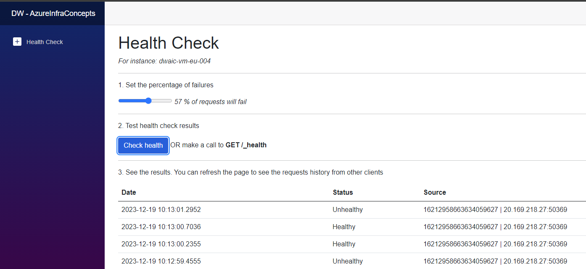

# INTRODUCTION

This LAB provides scripts to deploy sample services and all types of load balancers available in Azure to play with them. 

The architecture of target solution includes:

1. 4 Virtual Machines - 2 per region (West Europe and East US)
2. 2 App Services - in West Europe region
3. Load Balancers
    - Azure Load Balancer (Regional) - One in each region connected to VMs
    - Azure Load Balancer (Global) - Connected to both regional Load Balancers
    - Azure Application Gateway - One in each region connected to VMs (and Web App in West Europe region)
    - Azure Traffic Manager - Connected to regional Load Balancers
    - Azure Front Door - Connected to regional Load Balancers
4. Public IP addresses connected directly to VMs - for testing purpose to make ad-hoc configurations.

# HOW TO START

1. Deploy resources to your Azure subscription using '.\Deploy.ps1 -All' script
    > There are other options for deployments by changing the flag

        -All - Deploys all resources
        -TestServices - Deploys testing services (VMs and WebApps) including infrastructure and application code
        -LoadBalancer - Deploys Azure Load Balancer (requires TestServices to be deployed)
        -ApplicationGateway - Deploys Azure Application Gateway (requires TestServices to be deployed)
        -TrafficManager - Deploys Azure Traffic Manger (requires TestServices to be deployed)
        -FrontDoor - Deploys Azure FrontDoor (requires TestServices to be deployed)
        -Cleanup - Removes resource group with all deployed resources
        -Configs - Load current IP adresses and DNSes

2. Now you can use deployed resources for your testing or analysis! As a result of the script you will get target IPs and DNSes. You can also login to your Azure Subscription to check created resources. 
3. You can use testing script in 'tests' folder
   - TEST001 - LoadBalancing.ps1 - Makes a call to load balancer and displays results with information which server was processing our request
   - TEST002 - Latency.js - Load test to measure latency using K6 tool
4. To play with availability of the service you can open test application of specyfic VM (via public IP or exposed by Load Balancer) and change percent of failures. On the same page you can monitor history of requests from clients and health checks

    

5. When you completed your testing, you can remove resource group with all resources by executing '.\Deploy.ps1 -Cleanup' script
